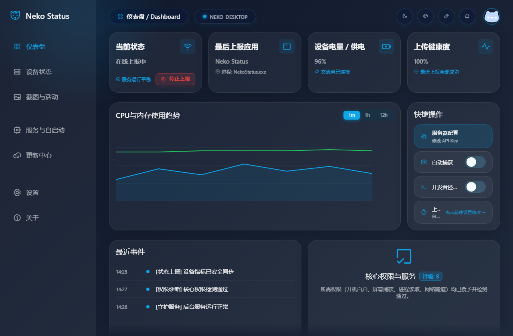
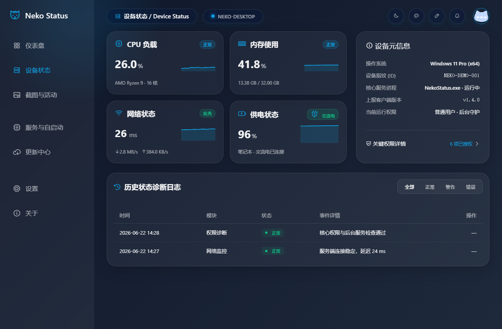
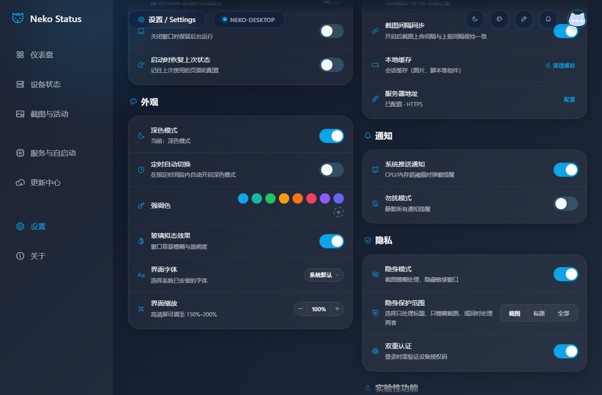

<div align="center">
  
  <h1>Neko Status Desktop</h1>
  <p>面向 Windows 的设备状态监控、隐私截图上报与在线活动提醒客户端。</p>

  <p>
    <a href="https://github.com/Neko-NF/Neko-Status-Desktop/releases/latest"></a>
    <a href="https://github.com/Neko-NF/Neko-Status-Desktop/actions/workflows/ci.yml"></a>
    
    
  </p>

  <p>
    <a href="https://github.com/Neko-NF/Neko-Status-Desktop/releases/latest"><strong>下载最新版</strong></a>
    · <a href="./CHANGELOG.md">查看更新日志</a>
    · <a href="./docs/architecture.md">了解架构</a>
  </p>
</div>



## Neko Status 能做什么

Neko Status 将 Windows 设备指标、后台上报和隐私控制集中在一个桌面客户端中。你可以在本机查看运行状态，也可以连接已配置的服务端，让自己的设备在不同终端之间保持可见。

| 能力 | 说明 |
| --- | --- |
| 实时设备状态 | 展示 CPU、内存、网络延迟、供电状态、系统信息与运行权限。 |
| 状态与截图上报 | 按设定间隔同步设备状态；截图上传独立控制，默认关闭。 |
| 隐私保护 | 支持敏感应用规则、标题隐藏、截图模糊与全局模糊。 |
| 后台守护 | 支持托盘运行、开机自启、服务体检、异常恢复与 Windows 通知。 |
| 更新中心 | 支持稳定版/Beta/Nightly 通道、多更新源、完整性检查、下载与回滚。 |
| 可选扩展 | 关注动态、应用上线提醒、OBS/SRS 直播推流与 UI 实验室均按需开启。 |

## 界面预览

<p align="center">
  
  <br><br>
  
</p>

> 图片使用匿名演示设备与合理的示例指标生成，不包含真实设备 ID、账户、密钥或本地路径。

## 下载与安装

前往 [GitHub Releases](https://github.com/Neko-NF/Neko-Status-Desktop/releases/latest) 获取最新稳定版本：

| 文件 | 适用场景 |
| --- | --- |
| `NekoStatus-Setup-*.exe` | 推荐普通用户使用，支持安装目录、桌面快捷方式和开始菜单。 |
| `NekoStatus-*-win.zip` | 便携使用，解压后直接运行。 |
| `SHA256SUMS.txt` | 校验下载文件是否完整。 |

> 当前安装包尚未提供商业代码签名。若 Windows SmartScreen 显示未知发布者，请先核对下载来源和 SHA256，再选择“更多信息 → 仍要运行”。

## 第一次使用

1. 下载并安装 `NekoStatus-Setup-*.exe`，或解压便携版。
2. 打开客户端后登录/注册，在线模式会为当前设备自动配置设备密钥；已有密钥也可以在服务器配置中手动填写。
3. 检查服务器地址、上报间隔和隐私选项，然后在仪表盘或“服务与自启动”页面启动上报。

截图上传、关注动态和活动窗口缩略图均不会在首次启动时自动开启。需要这些能力时，请先阅读对应页面的说明并主动启用。

## 隐私与安全

- 整屏截图上传默认关闭；开启后仅上传到当前配置的服务端。
- 可按应用添加隐私规则，并选择只隐藏标题、只模糊截图或同时处理两者。
- 关注动态中的窗口缩略图独立控制且默认关闭，不与完整状态上报共用截图链路。
- 更新中心支持安装资产完整性检查；手动下载时也建议使用 Release 中的 `SHA256SUMS.txt` 校验文件。
- 设备密钥、Token 和其他敏感配置不应写入 Issue、日志截图或提交到仓库。

## 实验性功能

在“设置 → 实验性功能”中可以分别启用：

- 关注动态与应用上线提醒；
- OBS / SRS 直播推流入口；
- UI 实验室和数学曲线加载效果。

实验功能可能依赖对应服务端能力，并可能随版本调整。生产环境建议保持稳定通道，仅开启确实需要的入口。

## 本地开发

开发环境建议使用 Node.js 22 LTS、npm 10+。构建随安装包发布的 Presence Agent 时，还需要 Rust stable MSVC 工具链。

```powershell
npm ci
npm run dev
```

常用验证命令：

```powershell
npm run verify
npm run test:smoke
npm run build:zip
```

核心目录：

```text
src/main/       Electron 主进程、本地服务与系统能力
src/preload/    Renderer 的安全 IPC 桥接层
src/renderer/   页面、组件、状态与交互
src/shared/     IPC 常量、Schema 与跨层契约
native/         Rust 原生后台代理
```

## 文档与贡献

- [架构说明](./docs/architecture.md)
- [IPC 契约](./docs/ipc-contract.md)
- [测试规范](./docs/testing-guideline.md)
- [发布流程](./docs/release-process.md)
- [项目状态](./docs/project-status.md)
- [贡献指南](./CONTRIBUTING.md)
- [版本记录](./CHANGELOG.md)

提交问题时请说明应用版本、Windows 版本、复现步骤和预期结果；涉及界面问题时可以附脱敏截图。
