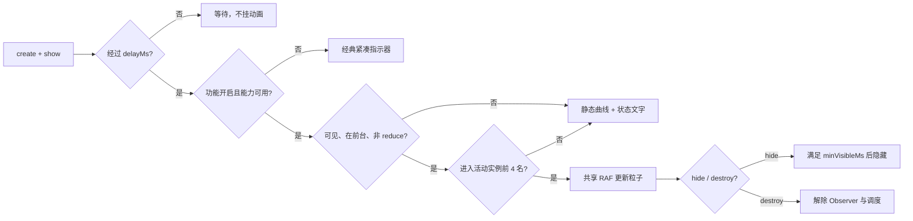

# Neko 数学曲线加载系统与 UI 实验室

> 状态：P2 实验功能，Electron 端首发；默认关闭
> 上游评估基线：`Paidax01/math-curve-loaders@70f4e00a6d452532039ff7c2ccb4c379ec90c772`
> 实现原则：独立实现、无运行时网络请求、无新增 npm 依赖

## 1. 决策与来源记录

### 1.1 上游评估

[Paidax01/math-curve-loaders](https://github.com/Paidax01/math-curve-loaders) 展示了以数学曲线替代普通圆环的加载反馈，适合作为 UIUX 方向参考。评估固定在 [commit 70f4e00](https://github.com/Paidax01/math-curve-loaders/commit/70f4e00a6d452532039ff7c2ccb4c379ec90c772)，避免后续上游变化悄然改变本项目结论。

截至本次实现，上游仓库没有许可证文件，[授权询问 #2](https://github.com/Paidax01/math-curve-loaders/issues/2) 也没有得到许可答复。缺少许可证不等于可以复制，因此本项目执行以下门禁：

- 不复制、改写或打包上游 JavaScript、CSS、HTML、图片及其他资源。
- 不把上游仓库作为 npm、Git submodule、CDN 或运行时依赖。
- 只借鉴“用数学曲线表达等待状态”这一抽象视觉方向。
- 曲线使用公开的标准数学公式与 Neko 原创公式独立实现，代码来源仅为本仓库。
- 若上游以后补充许可证，必须重新做许可证兼容、代码差异和 NOTICE 审查；不会自动切换为上游代码。

### 1.2 实验目标

本功能首先解决加载反馈语义不一致，再把数学曲线作为可识别的 Neko 视觉语言。曲线动画只能表示“系统正在等待一个不可确定完成时间的操作”，不能作为常驻装饰、成功庆祝或页面背景。

实验默认全部关闭。关闭时，用户继续看到经典紧凑指示器、骨架屏或进度条，业务流程不依赖曲线引擎才能完成。

## 2. 加载语义矩阵

| 任务语义 | 首选反馈 | 示例 | 禁止做法 |
| --- | --- | --- | --- |
| 显眼、非确定等待 | 数学曲线 + 明确文字 | 启动检查、系统初始化、网络诊断、详情加载 | 伪造百分比，或只显示无文字动画 |
| 按钮触发的短操作 | 紧凑 busy | 登录、保存、刷新、测试连接 | 在按钮上放大型曲线，或改变按钮宽度导致跳动 |
| 结构化首屏 | 骨架屏 | 公告列表、卡片列表 | 用曲线替代内容结构预期 |
| 可计算任务 | 进度条 + 百分比/速度/大小 | 更新下载、安装 | 曲线遮盖确定进度 |
| 静默后台任务 | 状态徽章或文字 | 周期上报、轮询 | 弹出遮罩或持续抢占注意力 |

section/overlay 默认延迟 `180ms`，避免瞬时操作闪烁；一旦显示，最短可见 `320ms`，避免视觉抖动。按钮 busy 立即反馈。

## 3. 现有页面迁移表

| 区域 | 新语义 | 当前落地 |
| --- | --- | --- |
| 启动更新检查/准备 | 曲线；进入下载后切回确定进度 | `startup-update.js` 接入，payload 向后兼容 |
| 更新中心检查、来源检查和诊断 | 曲线或紧凑 busy | 检查区使用曲线，操作按钮统一 busy |
| 公告详情 | 曲线 | 详情容器按网络场景创建实例 |
| 公告列表 | 骨架屏 | 保留，不迁移为曲线 |
| 隐私窗口列表 | 曲线 | 列表区域级加载 |
| 设备权限和元数据初始化 | 单个区域级曲线 | 六个权限行不再各自旋转 |
| 搜索/诊断 | 曲线或区域级状态 | 默认映射 `spiral-search` |
| 认证、配置、仪表盘、服务、设置、直播、活动、公告、更新、shell 操作 | 紧凑 busy | 通过 `setButtonBusy()` 统一保存与恢复状态 |
| 更新下载/安装 | 进度条、百分比、速度和大小 | 原确定进度保留且优先显示 |

迁移期 `.ph-spin`、`.diag-spinner` 等类仍可使用，但全部指向唯一的 `neko-busy-spin` 动画。禁止再创建新的 `spin`、`stgSpin`、`spin-anim` 等重复 keyframes。

## 4. 曲线注册表

实现位于 `src/renderer/js/components/loading-curves.js`。每个定义统一包含：

- `id`：跨版本稳定、用于持久化的 kebab-case 标识。
- `family`、`name`、`description`、`usage`、`motionSummary`、`formulaNote`、`recommendedFor`。
- `closed`：是否为闭合曲线。
- 默认运动参数：`durationMs`、`particleCount`、`trailLength`、`travelMode`、`tempo`、`pulse`、`rotation`。
- `point(t)`：输入归一化参数 `t ∈ [0, 1]`，返回有限二维坐标。

运动定义必须服务加载语义，而不是复用一套匀速圆环模型。首发预设包含 `loop`、`open` 和 `pingpong` 三类路径行进方式；`tempo` 使用周期性微扰或缓入缓出制造非线性速度；`rotation.mode` 可为 `none`、`sway`、`drift` 或 `continuous`。除机械诊断类预设外，不应默认整体匀速旋转。

### 4.1 首发 9 族 12 预设

| 家族 | 稳定 ID | 名称 | 推荐场景 |
| --- | --- | --- | --- |
| Neko | `neko-head` | 猫耳巡游 | 启动、系统初始化 |
| Neko | `neko-paw` | 猫爪花环 | 轻量交互等待 |
| Neko | `neko-tail` | 卷尾螺旋 | 安静后台准备 |
| Rose | `rose-five` | 五瓣花轨 | 品牌型普通等待 |
| Rose | `rose-seven` | 七瓣花环 | 大区域内容加载 |
| Lissajous | `lissajous-drift` | 星轨编织 | 网络同步 |
| Lemniscate | `lemniscate-bloom` | 无限回环 | 安静后台等待 |
| Hypotrochoid | `hypotrochoid-loop` | 齿轮内旋 | 系统处理、诊断 |
| Cardioid | `cardioid-pulse` | 心形脉冲 | 账户与个人资料 |
| Spiral | `spiral-search` | 螺旋搜寻 | 搜索与诊断 |
| Butterfly | `butterfly-phase` | 蝶翼相位 | 复杂聚合阶段 |
| Fourier | `fourier-flow` | 谐波流 | 多阶段数据处理 |

默认自动映射：

```text
startup / system -> neko-head
network          -> lissajous-drift
search           -> spiral-search
background       -> lemniscate-bloom
```

### 4.2 Neko 原创公式

- 猫耳巡游：以周期极坐标轮廓为基底，在左右耳方位叠加包裹高斯峰。包裹距离处理 `2π` 边界，保证耳峰连续。
- 猫爪花环：以四个包裹高斯趾豆、一个下方肉垫峰、顶部凹谷和侧向收束组成连续猫爪轮廓；它不是任何外部 SVG 的拟合，也不再使用近似四边形的超公式。
- 卷尾螺旋：使用逐渐收束的开放阿基米德式螺旋。开放曲线的粒子透明度在首尾交接，避免从终点瞬移回起点。

### 4.3 新增曲线模板

新增预设不得绕过注册表。至少完成以下清单：

```text
[ ] 稳定且未占用的 id
[ ] 家族、中文名称、说明、公式备注和推荐场景
[ ] 面向用户的 usage 与 motionSummary
[ ] point(t) 对完整定义域返回有限值
[ ] 预采样归一化后位于安全边界
[ ] closed=true 时满足闭合误差门限；开放曲线定义首尾淡出
[ ] tempo 非线性速度可解释；除非语义需要，不得默认整体匀速旋转
[ ] 静态缩略图可读，深浅主题与高对比模式可见
[ ] 单元测试和 UI 实验室卡片随注册表自动出现
```

删除或重命名已发布 ID 会破坏用户偏好，原则上禁止。未知 ID 按 `auto` 运行，但原始配置值保持不变，以便新旧版本前向兼容。

## 5. 加载系统接口

浏览器接口挂载为 `window._nekoModules.components.LoadingSystem`。

### 5.1 创建实例

```js
const loading = LoadingSystem.create(target, {
  context: 'network',       // startup | system | network | search | background
  mode: 'section',          // overlay | section | inline
  size: 96,
  label: '正在同步数据…',
  variant: 'auto',          // auto 或稳定 Curve ID
  delayMs: 180,
  minVisibleMs: 320,
  preview: false,
});

loading.show();
loading.setLabel('正在整理结果…');
loading.setVariant('neko-paw');
loading.hide();
loading.destroy();
```

Controller 的 `show()`、`hide()`、`destroy()` 均可重复调用。目标区域同步 `aria-busy`；SVG 为 `aria-hidden="true"`，容器使用 `role="status"` 与 `aria-live="polite"`。

### 5.2 按钮 busy

```js
LoadingSystem.setButtonBusy(button, true, { label: '保存中…' });
LoadingSystem.setButtonBusy(button, false);
```

系统保存并恢复原内容、宽度、disabled 和 ARIA 状态。busy 文案通过 `textContent` 写入；重复开启或关闭不得破坏原状态。

### 5.3 偏好与诊断

```js
LoadingSystem.applyPreferences({
  enabled: true,
  style: 'auto',
});

const diagnostics = LoadingSystem.getDiagnostics();
// active / paused / static / total / frameMs
```

偏好实时作用于已有实例。关闭功能后，业务仍显示经典指示器与状态文字。

## 6. 状态流、调度器与降级



- 曲线挂载时预采样 480 点并生成静态 SVG path，帧循环不重建 path。
- 帧循环只更新尾迹粒子、组变换和透明度；粒子行进速度由注册表 `tempo` 调制，不采用全部预设同一套匀速绕圈。
- 全部实例共享一个 RAF 调度器；没有活动实例时不请求下一帧。
- 同时最多动画化 4 个实例，优先级为 overlay、section、inline；其余显示静态轨迹。
- 页面隐藏、窗口后台、元素离屏、实验关闭或 `prefers-reduced-motion: reduce` 时暂停更新。
- UI 实验室 12 个卡片只生成静态 SVG，只允许主预览进入调度器。
- 公式产生非有限值、SVG 能力不可用或实例构建异常时，自动降级为经典指示器，不抛出到业务流程。
- `prefers-contrast` / forced colors 下以 `currentColor` 呈现，不依赖颜色区分加载状态。

## 7. 配置与发布门禁

| 配置 | 默认值 | 说明 |
| --- | --- | --- |
| `enableExperimentalUiLabEntry` | `false` | 仅控制 UI 实验室入口与页面访问 |
| `enableExperimentalCurveLoaders` | `false` | 控制曲线是否应用到正式页面 |
| `loadingCurveStyle` | `"auto"` | `auto` 或稳定 Curve ID |

关闭全局 `enableExperimentalFeatures` 时，两个实验布尔值强制关闭，`loadingCurveStyle` 保留。所有配置继续复用现有 Config IPC，不新增 channel。

发布阶段：

1. 内部实验：默认关闭，只在 UI 实验室预览和指定正式入口启用。
2. 扩大实验：观察降级率、帧耗时、可访问性反馈和快速切页稳定性。
3. 稳定化候选：配置迁移与 Curve ID 冻结，完成全页面加载语义审计。
4. 正式功能：只有性能、无障碍和回滚门禁均满足后，才讨论默认开启。

稳定化条件：没有重复 RAF/Observer；正式界面活动实例不超过 4；减少动态效果完全静态；所有确定任务仍以进度为主；深浅主题和 80%–200% 缩放通过。

回滚条件：持续帧耗时异常、可见卡顿、前后台切换泄漏、状态文字缺失、业务被加载器异常阻断或用户反馈动画造成明显不适。回滚只需关闭曲线实验或全局实验开关，不做数据迁移。

## 8. UI 实验室

“UI 实验室”是可扩展实验容器，不以 loader 命名。当前首个模块包括：

- 正式页面应用开关。
- 自动搭配/固定风格选择；固定选择即时预览并持久化。
- 一个大型实时预览和 startup、network、search、background 四种真实加载场景卡片。
- 当前曲线的正式使用位置 chips、用户可读动效反馈和折叠式公式备注。
- 由注册表生成的 12 个静态曲线卡片；卡片显示适用场景与动效性格，而不是只展示家族名。
- 面向设计验收的体验与性能保护摘要，开发诊断数字保持次级展示。
- 后续按钮、卡片、主题、排版和转场实验的结构占位。

入口由 `enableExperimentalUiLabEntry` 控制。入口关闭时，如当前路由就是 UI 实验室，先返回仪表盘，再隐藏入口，避免不可达活动页。

## 9. 测试与验收

自动测试：

```bash
node --test tests/unit/loading-system.test.js
node --test tests/unit/ui-lab.test.js
npm run verify
npm run test:smoke
```

核心断言：

- 12 个 ID 唯一、9 个家族存在、全部采样有限且归一化。
- 闭合曲线满足首尾误差，开放曲线具有首尾透明交接。
- 注册表包含用户可读用途、动效描述、非线性 `tempo` 元数据和非统一旋转策略。
- 未知风格回退到自动映射但不改写原配置。
- 共享 RAF、活动实例上限、离屏/隐藏/reduce 暂停。
- 延迟显示、最短可见、幂等销毁。
- 按钮重复调用、原内容与 disabled 恢复、ARIA 和异常分支。
- UI 实验室入口门禁、路由回退、12 个静态缩略图、单活动预览、场景使用位置说明、点击反馈、选择持久化和应用开关。
- 配置默认值、旧配置合并、全局关闭级联和风格保留。
- 启动更新新增字段不影响旧 payload，确定进度继续使用进度条。

手工验收矩阵：深浅主题、全部强调色、80%–200% 缩放、窄窗口、键盘操作、减少动态效果、高对比模式、窗口最小化、快速切页。性能要求为实验室仅一个活动预览、隐藏页面活动实例为 0、正式页面活动实例不超过 4，销毁后无更新。

发版前还需运行全部启动更新 dev scenario 和 `npm run build:zip`。

## 10. 未来 Tauri `NSpinner` 映射

Electron 接口保持业务语义，Tauri 重构时按下表映射，不把 renderer DOM 实现原样搬运：

| Electron | Tauri / Vue 目标 |
| --- | --- |
| `LoadingSystem.create(target, options)` | `<NSpinner :context :mode :size :label :variant />` |
| Controller `show/hide` | `v-model:visible` |
| `setLabel/setVariant` | 响应式 props |
| `destroy` | Vue unmount / composable cleanup |
| `setButtonBusy` | `<NButton :loading loading-label>` |
| `applyPreferences` | `useLoadingPreferences()` + config store |
| `getDiagnostics` | `useLoadingDiagnostics()`，仅开发/实验环境 |

Tauri 版本必须继续复用稳定 Curve ID、同一语义矩阵、单调度器、4 实例上限、reduce-motion 和静态画廊门禁。新增预设仍只能通过注册表进入。
