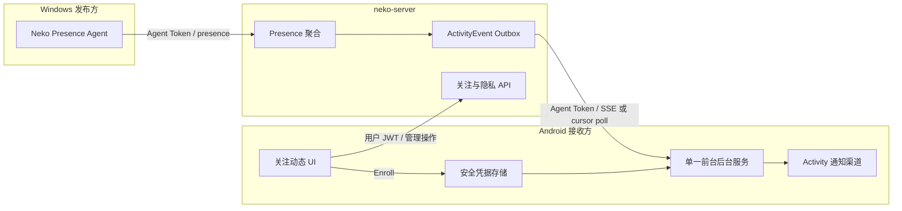

# 09 — Android 手机端在线提醒与保活联调落地方案

> 状态：讨论稿 v0.1
> 编写日期：2026-06-22
> 涉及项目：`Neko_Status`、`neko-server`、`Android_NF/power_pulse`

## 结论先行

手机端首发建议先完成“桌面活动上线 → 服务端事件 → Android 后台接收 → Android 系统通知”的可靠闭环，并在手机端提供与桌面端一致的关注、规则、隐私、公开应用和拉黑管理。

首发采用以下边界：

- Android 首发是活动事件接收端和管理端，不发布手机本机前台应用。
- Android 本机应用发布作为第二阶段，届时再引入 `android:<package.name>`，不把 Android 包名伪装成 Windows `.exe`。
- 手机活动功能需要账号登录；原有设备状态上报继续使用扫码得到的 `deviceKey`，两套凭据不混用。
- 后台提醒复用现有 Android 前台服务进程，不默认新增第二个常驻 watchdog 前台服务。
- 实时通道沿用 Agent Token + SSE，失败时游标轮询；不复用 Widget Token，也不使用用户 JWT 常驻收事件。
- Android 生产地址统一迁移到 `https://nekostatus.koirin.com`，不能继续默认使用旧的 `https://nf.koirin.com`。
- “保活成功”不能只靠一个布尔值判断。页面展示可验证状态、厂商专项步骤和一次端到端测试，并明确说明“强制停止后任何应用都无法自行恢复”。

这一路径不要求修改桌面 Agent 协议，可以先与现有 Windows 客户端兼容发布。

## 当前实现审计

截至 2026-06-22，三端真实状态如下：

| 项目 | 已有能力 | 与手机联调相关的缺口 |
| --- | --- | --- |
| `D:\VScode project\Neko_Status` | Activity 页面、主进程控制器、Rust Presence Agent、Agent Token、SSE/轮询、Windows Toast、活动快照和相关测试已在工作区实现 | 相关文件仍包含未提交改动；需要先固定可联调基线，不应一边改协议一边继续扩展 UI |
| `Z:\NF\neko-server` | Activity Prisma 模型、关注/规则/隐私/应用目录/事件/快照 API 已实现，公网 Activity API 当前已启用 | Enroll 固定签发全量 scope、创建新设备时固定为 Windows；移动身份语义、测试通知、Agent 自撤销和连接规模治理尚未完成 |
| `D:\VScode project\Android_NF\power_pulse` | Flutter 前台服务、状态上报、前台应用检测、本地通知、小组件、开机广播、电池优化与厂商设置跳转已存在 | 没有账号 JWT、Activity Agent Token、SSE、活动通知、活动页和安全存储；默认生产域名仍是旧地址；保活增强工作区有未提交改动 |

联调前必须先做一次三仓检查点：

1. 桌面端和服务端将当前 Activity 实现形成可回退的提交或补丁快照。
2. Android 将现有“状态上报保活修复”单独形成检查点，不与 Activity 功能混成一个不可拆分提交。
3. 固定 Activity REST/SSE 协议版本为 `protocolVersion=1`；新增字段只做可选字段，旧 Agent 必须继续工作。
4. Android 先完成生产域名迁移，再开始账号和 Activity Token 联调，避免请求被发送到旧服务器。

## 产品范围

### 手机首发 P0

- 账号登录、登录状态校验和安全退出。
- 启用/停用“应用上线提醒”。
- Android Activity Agent Enroll、轮换和撤销。
- 后台 SSE 接收、断线重连、游标轮询降级和陈旧事件过滤。
- 文字通知、头像、活动快照大图、失败降级和通知点击跳转。
- “关注动态”页面：当前在线、最近事件、连接状态和手动刷新。
- 搜索用户、关注/取消关注、规则新增/开关/删除。
- 我的可见范围、全局快照分享、公开应用、关注者和拉黑管理。
- 保活引导：通知权限、前台服务、电池优化、厂商自启动/后台运行设置、通知渠道检查和端到端测试。
- 服务端与桌面端兼容回归。

### P1 增强

- 每台设备独立的提醒静音、时段和通知样式。
- Activity 凭据设备列表及远程撤销。
- 服务端 SSE 连接和数据库轮询规模优化。
- 动态列表本地分页、搜索和已读状态。
- 更细的弱网诊断与一键导出脱敏诊断包。

### 第二阶段：Android 本机活动发布

- 使用 `android:<package.name>` 作为 `appKey`。
- Android 用户主动公开应用后才允许发布。
- 使用 Usage Events 或无障碍缓存做稳定判定，不上传窗口标题或界面内容。
- Android 首版发布不提供应用截图；以后若做，必须重新设计 MediaProjection 授权和隐私模型。
- Windows 与 Android 应用目录共存，规则按完整 `appKey` 区分。

### 首发非目标

- 不引入 FCM/Firebase；国内设备和现有私有部署先沿用 SSE。
- 不让 Widget Token、`deviceKey` 或用户 JWT直接读取 Activity 事件和私有快照。
- 不承诺应用被用户“强制停止”后仍可自动恢复。
- 不通过 30 秒精确闹钟、永久 WakeLock 或多个常驻前台服务暴力保活。
- 不把“已忽略标准电池优化”描述为“厂商系统一定不会杀后台”。

## 端到端架构



职责必须保持清晰：

| 组件 | 职责 |
| --- | --- |
| Android UI Isolate | 登录、配置、管理关注关系、展示状态、启动保活引导 |
| Android 后台 Isolate/前台服务 | Bootstrap、SSE、轮询、游标、图片下载、发通知、健康心跳 |
| Android 原生层 | 前台服务通知、通知渠道、系统设置跳转、开机恢复和可验证系统状态 |
| `neko-server` | 用户鉴权、最小权限凭据、事件 Outbox、权限校验、测试事件和限流 |
| Windows Agent | 保持现有发布与 Windows 通知能力，不感知 Android UI |

## 身份、凭据与存储

手机端同时存在三种身份，必须分开命名、存储和撤销：

| 凭据 | 用途 | 服务端权限 | 本地存储 |
| --- | --- | --- | --- |
| `deviceKey` | 原有设备状态上报、Widget Token 获取 | 旧设备接口 | 保持现状，后续单独安排安全迁移 |
| 用户 `authToken` | 关注、规则、隐私、公开应用、Enroll | 用户级管理 API | Android Keystore 支持的安全存储 |
| `activityAgentToken` | Bootstrap、事件和私有活动快照 | 首发仅 `events:read,bootstrap:read` | Android Keystore 支持的安全存储 |

推荐引入 `flutter_secure_storage`，至少保护用户 JWT、Activity Agent Token、Activity 设备 ID 和事件游标。SharedPreferences 只能保存非敏感开关、时间戳和诊断状态。

禁止：

- 在日志、通知正文、异常上报或 UI state 中输出完整 Token。
- 把 Activity Agent Token 复制进 Widget 原生 SharedPreferences。
- 用 `deviceKey` 调用关注/规则/隐私接口。
- 将用户 JWT交给长期 SSE；用户 JWT过期不能导致已经 Enroll 的后台提醒立刻中断。

### 推荐登录方案

复用现有 `/api/auth/login`，请求增加可选 `clientType: "android"`。服务端签发 `source=android-client` 的 7 天用户 JWT，并让 `getRequestSession()` 同时接受现有 `desktop-client` 和新的 `android-client`。

用户 JWT过期时：

- 后台 Activity Agent Token 继续接收提醒。
- 管理页进入“登录已过期，后台提醒仍在运行”状态。
- 用户重新登录后重新校验 Activity 设备归属，必要时轮换 Agent Token。
- 不保存用户密码。

手机已扫码绑定的 `deviceId` 与登录用户不一致时必须阻止 Enroll，并引导用户重新登录或重新配对，不能静默创建跨账号绑定。

## 服务端改造

### 1. Enroll 最小权限化

现有桌面请求已经发送 `capabilities`，但服务端目前忽略该字段并固定签发：

```text
presence:write,events:read,bootstrap:read,snapshot:write
```

改造后的请求：

```http
POST /api/activity/agent/enroll
Authorization: Bearer <user JWT>
Content-Type: application/json
```

```json
{
  "deviceId": 123,
  "deviceName": "Pixel 9 的在线提醒",
  "platform": "Android",
  "clientType": "android",
  "capabilities": ["events", "bootstrap"]
}
```

scope 映射：

| capability | scope |
| --- | --- |
| `events` | `events:read` |
| `bootstrap` | `bootstrap:read` |
| `presence` | `presence:write` |
| `snapshots` | `snapshot:write`，首版只允许受支持的 Windows 发布端 |

服务端从允许列表计算 scope，不能接受客户端直接提交 scope 字符串。桌面端现有 capability 继续得到原有权限，Android 首发只得到读取权限。

如果没有传入 `deviceId`，服务端按 `platform` 创建活动专用设备；默认设备名不能再硬编码成“Windows 活动提醒”。

`ActivityAgentCredential` 增加向后兼容的 `clientType` 字段，现有记录默认 `windows`，新手机凭据写入 `android`。该字段用于灰度开关、指标、并发限制和定向撤销，不用于替代 scope 鉴权。

### 2. Agent 自撤销

现有 `DELETE /api/activity/agent/enroll` 需要用户 JWT。补充“当前 Agent Token 只撤销自己”的路径，解决用户 JWT过期时的安全退出：

```http
DELETE /api/activity/agent/credential
Authorization: Bearer <Agent Token>
```

成功后立即设置当前 credential 的 `revokedAt`，不能撤销其他设备。

### 3. 端到端测试事件

新增：

```http
POST /api/activity/notifications/test
Authorization: Bearer <user JWT>
```

行为：

- 为当前用户写入一条 `activity.test` 事件。
- Payload 不包含其他用户或快照。
- 每用户 30 秒最多一次。
- 返回事件 ID；Android 页面等待对应事件到达并显示耗时。
- 测试成功必须验证“服务端写入、后台连接、通知权限、通知渠道”整条链路，不只是本地弹一条假通知。

### 4. 兼容性与权限修正

- 保持 `protocolVersion=1`，新增 `clientType`、`platform` 和 `capabilities` 为可选字段。
- 修正 `followers` 可见性中管理员是否必须先关注的实现与文档差异。当前产品文档要求管理员也必须关注，应以此为准。
- 所有 Activity 管理路由接受 `android-client` JWT。
- 快照下载继续只接受收到关联事件的 Agent Token。
- 扩展事件查询的历史模式：消费循环继续使用 `after` 升序游标，页面历史使用 `before` + `limit` 倒序分页；两种模式不能混传。
- 登录、Enroll、搜索、测试事件和 SSE 重连增加限流；同一 credential 只允许有限数量并发 SSE。
- 统一错误结构为 `{ success:false, error:{ code,message,details? } }`，Android 不依赖中文 message 做逻辑判断。

### 5. 移动规模前的 SSE 审计

当前 SSE 实现为每个连接每秒查询一次事件表。桌面 Beta 可接受，但手机扩量后数据库查询会随在线设备线性增长。

发布策略：

- 内测阶段保留现有实现，记录在线 SSE 数、每秒查询数和平均事件延迟。
- 公测前评估改为进程内订阅通知、数据库通知或独立消息层；至少把空闲查询频率和连接上限参数化。
- SSE 健康时 Android 不做额外轮询。
- 反向代理必须禁用 SSE 缓冲并保证合理的空闲超时。

### 6. 服务端开关

建议拆分：

```env
ACTIVITY_FOLLOW_ENABLED=true
ACTIVITY_ANDROID_RECEIVER_ENABLED=false
```

Android 开关关闭时只拒绝新 Android Enroll；Windows Activity 不受影响。回滚手机端时无需关闭整套桌面功能。

### 7. 手机端接口清单

| 接口 | 鉴权 | Android 用途 | 服务端改动 |
| --- | --- | --- | --- |
| `POST /api/auth/login` | 用户名/密码 | 手机账号登录 | 支持 `clientType=android` |
| `GET /api/auth/me` | 用户 JWT | 恢复登录和过期检测 | 接受 `android-client` |
| `POST /api/activity/agent/enroll` | 用户 JWT | 签发 receive-only Agent Token | platform/capabilities/最小 scope |
| `DELETE /api/activity/agent/enroll` | 用户 JWT | 登录有效时撤销指定设备 | 保持兼容 |
| `DELETE /api/activity/agent/credential` | Agent Token | JWT过期时自撤销 | 新增 |
| `GET /api/activity/agent/bootstrap` | Agent Token | 当前在线、规则摘要、初始游标 | 保持兼容 |
| `GET /api/activity/events/stream` | Agent Token | 实时事件 | 并发限制和移动指标 |
| `GET /api/activity/events?after=` | Agent Token | 断线恢复消费 | 保持升序游标 |
| `GET /api/activity/events?before=&limit=` | Agent Token | 动态页历史分页 | 新增查询模式 |
| `GET /api/activity/snapshots/:id` | Agent Token | 下载事件绑定快照 | 保持严格接收者校验 |
| `POST /api/activity/notifications/test` | 用户 JWT | 保活端到端测试 | 新增 |
| `GET /api/activity/users/search` | 用户 JWT | 搜索用户 | 接受移动 JWT、限流 |
| `GET/POST/DELETE /api/activity/follows` | 用户 JWT | 关注管理 | 保持兼容 |
| `GET/POST/PATCH/DELETE /api/activity/rules` | 用户 JWT | 规则管理 | 保持兼容 |
| `GET/PUT /api/activity/me/privacy` | 用户 JWT | 可见性和全局快照开关 | 保持兼容 |
| `GET/POST/PATCH /api/activity/me/apps` | 用户 JWT | 公开应用管理 | 保持兼容 |
| `GET /api/activity/me/followers` | 用户 JWT | 关注者列表 | 保持兼容 |
| `GET/POST/DELETE /api/activity/blocks` | 用户 JWT | 拉黑管理 | 保持兼容 |

## Android 工程落地

### 推荐目录

不要继续把新功能堆进已经很大的 `main.dart`。新增独立 feature：

```text
lib/features/activity/
├── data/
│   ├── activity_api.dart
│   ├── activity_secure_store.dart
│   ├── activity_event_cache.dart
│   └── activity_repository.dart
├── models/
│   ├── activity_event.dart
│   ├── activity_follow.dart
│   └── activity_state.dart
├── services/
│   ├── activity_event_service.dart
│   ├── activity_notification_service.dart
│   └── activity_keepalive_diagnostics.dart
├── pages/
│   ├── activity_page.dart
│   ├── activity_login_page.dart
│   └── activity_keepalive_guide_page.dart
└── widgets/
    ├── activity_status_card.dart
    ├── activity_timeline.dart
    └── activity_rule_editor.dart
```

现有文件的最小改动：

| 文件 | 改动 |
| --- | --- |
| `lib/main.dart` | 增加“动态”导航入口和顶层状态监听；不实现 API 细节 |
| `lib/services/background_service.dart` | 增加 Activity 子循环和独立心跳；与状态上报故障隔离 |
| `lib/services/permission_service.dart` | 增加通知渠道、后台限制和 OEM 引导诊断；修正文案语义 |
| `lib/services/api_service.dart` | 生产域名迁移；旧状态上报接口保持不变 |
| `AndroidManifest.xml` | 收敛前台服务、Receiver 和权限；Activity 接收首发不新增 UsageStats/无障碍要求 |
| `MainActivity.kt` | 暴露可验证系统状态和分开的系统设置跳转，不自动连续弹两个设置页 |
| `PowerPulseApplication.kt` | 只做轻量启动协调，不每秒承担业务状态机 |

最近事件建议使用有上限的本地数据库缓存，例如 `sqflite` 保存最近 200 条脱敏事件元数据；图片仍存短期文件缓存，Token 不进入事件库。首次安装和清库后，页面通过 `before` 历史接口补齐最近事件，后台消费游标仍只由 EventLoop 单写，避免 UI 与后台并发覆盖。

### 生产域名迁移

Android 当前默认值和多处文案仍为 `https://nf.koirin.com`，而桌面联调固定地址是 `https://nekostatus.koirin.com`。上线前新增一次性迁移：

1. 默认生产地址改成 `https://nekostatus.koirin.com`。
2. 仅当用户保存值为空或精确等于旧默认地址时自动迁移。
3. 用户自定义域名不修改。
4. 同步迁移 Flutter、后台服务和原生 Widget 使用的所有 URL key。
5. 服务器 origin 变化时先停止 Activity 连接，尽力撤销旧 credential，再清除本地 Activity Token；绝不把旧 Token 发往新 origin。
6. 生产模式强制 HTTPS；明文 HTTP 只允许显式本地开发模式。

## 后台服务状态机

Activity 接收状态统一为：

| 状态 | 含义 | UI 行为 |
| --- | --- | --- |
| `disabled` | 用户未开启 | 显示开启入口 |
| `needs_login` | 无用户 JWT，且尚未 Enroll | 引导登录 |
| `needs_enroll` | 已登录但无 Agent Token | 显示“正在配置”或修复按钮 |
| `connecting` | Bootstrap/SSE 建连中 | 显示连接中，不假报成功 |
| `connected` | SSE 健康 | 显示最近心跳和最近事件时间 |
| `polling` | SSE 不可用，游标轮询中 | 显示弱网降级但继续工作 |
| `degraded` | 网络、通知权限或渠道异常 | 展示可操作原因 |
| `paused` | 用户临时暂停提醒 | 保留凭据，不显示活动通知 |
| `credential_error` | Token 无效或被撤销 | 停止重试轰炸，等待重新 Enroll |
| `stopped_by_user` | 用户永久关闭 | 撤销凭据、清理游标和缓存 |

### 与原状态上报的关系

同一前台服务内运行两个互相隔离的任务：

```text
Foreground runtime
├── StatusReportLoop      // 旧 deviceKey，上报本机状态
└── ActivityEventLoop     // Activity Agent Token，接收关注事件
```

关键规则：

- `reportEnabled=false` 时，Activity 提醒可以继续运行。
- `activityReminderEnabled=false` 时，旧状态上报可以继续运行。
- 只有两个任务都关闭时才停止前台服务。
- 状态栏“暂停上报”只暂停状态上报，不能顺手停止在线提醒；通知操作需要分别命名。
- 两个任务分别记录 `lastReportHeartbeatAt` 和 `lastActivityHeartbeatAt`。
- 任一任务异常不能重启整个进程形成循环；先取消自身请求、退避，再按任务级策略恢复。
- 服务常驻通知根据实际组合显示“状态上报中”“在线提醒中”或“两项服务运行中”。

现有原生 `shouldKeepAlive()` 不能再以“存在 deviceKey”为唯一条件，应改成：

```text
needsBackgroundRuntime = reportExpectedRunning || activityReminderExpectedRunning
```

## 事件同步算法

### 首次启用

1. 用户登录并 Enroll。
2. 使用 Agent Token 调用 Bootstrap。
3. 将 `latestEventId` 写入安全游标。
4. 渲染 Bootstrap 中的当前在线状态。
5. 从该游标建立 SSE，不补发历史系统通知。

### 正常连接

- SSE 使用一个长连接。
- 每个事件先按 ID 去重，再持久化游标。
- `activity.entered` 在 `createdAtMs` 距当前不超过 2 分钟时才弹系统通知。
- `activity.ended`、`activity.revoked`、`activity.app_hidden` 更新页面状态，不弹上线通知。
- 事件写入本地时间线后再推进 UI；图片失败不阻止游标推进。

### 断线恢复

- 退避使用 1/2/5/10/30/60 秒并加入抖动。
- SSE 多次失败后进入 `/api/activity/events?after=<cursor>` 游标轮询。
- 轮询每批最多 100 条，持续翻页直到追上；不能只取一批后跳过余下事件。
- SSE 恢复后立即停止轮询，任何时刻只有一个消费循环。
- 无网络时等待系统网络恢复信号，不做固定频率空请求。
- 401/403 不无限重连，进入 `credential_error`。

### 快照和头像

- 只允许服务端同 origin 的相对 URL。
- 快照请求携带 Agent Token；头像不得携带 Token 到第三方域名。
- 响应上限 2MiB，只接受 JPEG/PNG 文件头。
- 缓存文件名由事件 ID 和用途生成，不信任服务端文件名。
- 缓存最多 48 小时；关闭功能或退出账号时清理。
- 下载、解码和通知大图失败时降级成文字通知。

## Android 通知设计

至少分成两个渠道：

| 渠道 | 重要性 | 用途 |
| --- | --- | --- |
| `neko_status_service` | Low | 前台服务常驻状态，不重复响铃 |
| `neko_activity_alerts` | Default | 用户真正关心的应用上线提醒 |

Activity 通知：

- 标题：`<用户名> 正在使用 <应用名>`。
- 内容：在线秒数、来源设备和本地上线时间。
- 有头像时作为 large icon。
- 有活动快照时使用 BigPictureStyle；失败自动使用文字样式。
- `groupKey` 按被关注用户分组，事件 ID 生成稳定 Notification ID。
- 点击通知进入“动态”页并定位到事件。
- 通知渠道被用户关闭时，页面必须显示“系统已关闭活动提醒渠道”，并提供跳转；不能只看 `POST_NOTIFICATIONS`。

通知回调必须覆盖：

- 应用前台。
- 应用后台。
- 应用冷启动。
- 后台 Isolate 创建通知后，主 Isolate 稍后启动。

## 保活引导与自修复

### 设计原则

保活页不是权限清单，而是“让提醒可靠到达”的分步检查。每一步只做一件事，用户从系统设置返回后重新检测，不自动连续打开多个系统页面。

推荐步骤：

1. **允许通知**：检查运行时通知权限。
2. **检查活动提醒渠道**：检查 `neko_activity_alerts` 是否存在且未被关闭。
3. **启动在线提醒**：必须由用户手势首次启动前台服务。
4. **允许后台运行**：解释原因后请求标准电池优化豁免。
5. **厂商专项设置**：根据品牌显示自启动、后台活动、无限制电量等独立按钮和图文说明。
6. **运行端到端测试**：服务端发送 `activity.test`，页面记录是否收到、通知是否展示和端到端耗时。
7. **24 小时健康状态**：显示最近连接、最近心跳、最近事件、最近一次被系统重启时间。

状态文案要区分：

- “已允许通知”。
- “已忽略 Android 标准电池优化”。
- “系统当前未报告后台受限”。
- “厂商额外限制无法由应用完全验证，请按步骤确认”。

不能使用“后台运行正常”“已完全放行”等无法证明的绝对文案。

### 对现有保活改动的处理

可以保留的思路：

- 手动停止标志，避免用户停止后被立即拉起。
- 独立的业务心跳和卡死检测。
- 开机、应用更新、解锁等系统事件触发有界恢复。
- JobScheduler/AlarmManager 作为恢复兜底，而不是实时事件通道。
- 重启节流，防止服务崩溃循环。

首发前需要收敛：

- `ReportWatchdogService` 不作为默认第二个常驻前台服务，避免两个常驻通知和两个长期生命周期。
- 不使用 30 秒 `setExactAndAllowWhileIdle()` 自唤醒；在线提醒不是闹钟或日历类精确定时场景。
- 不维持长时间 PARTIAL_WAKE_LOCK；只在一次有界网络/恢复操作期间短暂持有并保证 `finally` 释放。
- `SCHEDULE_EXACT_ALARM` / `USE_EXACT_ALARM` 若仍为 Widget 需要，必须与 Activity 保活分开论证和开关，Activity 首发不依赖它。
- Receiver、Service 只在确需外部调用时 `exported=true`；自定义显式广播默认不导出。
- `PowerPulseApplication` 不每秒轮询业务配置；状态变化用事件或较低频健康检查驱动。
- 厂商设置 Activity 路径可能随系统更新失效，跳转失败时回退到应用详情页并显示手工路径。

Android 官方约束参考：

- [Foreground service types](https://developer.android.com/develop/background-work/services/fgs/service-types)
- [Restrictions on starting a foreground service from the background](https://developer.android.com/develop/background-work/services/fgs/restrictions-bg-start)
- [Schedule alarms](https://developer.android.com/develop/background-work/services/alarms/schedule)
- [Optimize for Doze and App Standby](https://developer.android.com/training/monitoring-device-state/doze-standby)

## 手机端页面结构

移动端底部导航建议调整为：

```text
首页 / 动态 / 设置 / 更多
```

“动态”页内部用三个分段：

### 动态

- 在线提醒总开关。
- 连接状态卡：已连接、轮询降级、需要处理、已暂停。
- 保活健康入口和测试通知。
- 当前在线卡片。
- 最近事件时间线。

### 关注

- 用户搜索。
- 我关注的人。
- 对方公开应用目录。
- 规则新增、开关和删除。
- 空状态、加载失败和局部重试。

### 我的公开

- 我的可见范围。
- “允许我的 Windows 上线提醒附带窗口快照”全局开关，避免让用户误解为手机截屏。
- 已公开/未公开应用。
- 手机可以管理服务端已经发现的 Windows 应用，也可在高级入口手填规范化 `.exe`；首发不提供“选择当前窗口”，更不能把手机当前 App 当成 Windows 应用公开。
- 关注我的人。
- 拉黑管理。

所有开关使用“处理中 → 服务端确认 → 本地确认”三态：

- 保存中禁用重复点击。
- 服务端失败恢复原值。
- 服务端成功但后台同步失败时显示部分失败并执行补偿或提供修复入口。
- 页面不显示“假成功”。

## 第二阶段 Android 活动发布协议

如果确认手机也要作为被关注者发布本机应用，服务端统一应用标识：

| 平台 | appKey | 原始标识 |
| --- | --- | --- |
| Windows | `win32:code.exe` | 规范化进程名 |
| Android | `android:com.tencent.mm` | 规范化 package name |

服务端改造：

- 将 `normalizeWindowsAppKey()` 扩展为按平台规范化，但保留 Windows 兼容入口。
- 从 Agent credential 绑定设备推导平台，不能完全相信请求体。
- `ActivityAppCatalog.processName` 后续重命名或增加通用 `appIdentifier`；采用加法迁移，旧字段先保留。
- 规则和会话继续按完整 `appKey` 聚合，同名 Windows/Android 应用不自动合并。
- Android Enroll 增加 `presence` capability 后才允许写 Presence。

Android 检测边界：

- 首选 Usage Events；无障碍缓存仅在用户已为旧状态上报授权时作为增强，不为“只接收提醒”强制申请。
- 稳定判定至少要求同一包持续前台 3 秒；锁屏、息屏和 10 秒无有效候选进入 idle。
- 新包默认不公开，只进入本人的未公开应用列表。
- 不上传 Activity 名称、通知内容、窗口文本或触摸数据。

## 开发阶段与交付物

### 阶段 0：基线与协议冻结

- 三个工作区建立检查点。
- 修正 Android 生产域名和迁移逻辑。
- 固定请求/响应样例、错误码、事件 payload 和兼容策略。
- 输出一组不含真实 Token 的联调账号/设备登记表。

完成标准：旧 Android 状态上报、桌面 Activity 和公网服务均可独立回归。

### 阶段 1：服务端移动身份基础

- 支持 `android-client` JWT。
- Enroll 支持 platform/capabilities 和最小 scope。
- 增加 Agent 自撤销和测试事件。
- 增加限流、Android 开关和权限单测。
- 修正文档与实现的管理员关注语义差异。

完成标准：用 curl/脚本可完成 Android 登录 → Enroll → Bootstrap → SSE → test event → self revoke。

### 阶段 2：Android 数据层与安全存储

- 新建 Activity feature 目录和模型。
- 实现账号登录、`/auth/me`、管理 API 和统一错误映射。
- 实现 secure store、账号/设备归属校验和 origin 绑定。
- 为现有 SharedPreferences 编写 URL 迁移测试。

完成标准：UI Isolate 可完成所有管理操作，Token 不出现在普通日志和 SharedPreferences。

### 阶段 3：Android 后台事件与通知

- 把 ActivityEventLoop 接入现有前台 runtime。
- 实现 Bootstrap、SSE、游标轮询、退避、去重和陈旧过滤。
- 实现文字/头像/大图通知、缓存和深链。
- 拆分状态上报和活动提醒的开关、心跳及停止动作。

完成标准：关闭 Flutter 主界面后仍能收到桌面端上线通知；图片失败仍收到文字通知。

### 阶段 4：Android 动态页与管理 UI

- 增加“动态”导航和三个分段页面。
- 接入当前在线、事件时间线、关注、规则、隐私、公开应用、关注者和拉黑。
- 实现保存等待态、失败恢复和局部重试。

完成标准：不打开桌面端即可在手机完成关注规则管理，变更立即影响服务端事件生成。

### 阶段 5：保活引导与稳定性

- 收敛现有 watchdog 实现为单 FGS、任务级心跳和有界恢复。
- 实现通知渠道、后台限制、电池优化和 OEM 设置诊断。
- 实现服务端测试事件和页面闭环结果。
- 完成 8 小时、24 小时和厂商 ROM 真机测试。

完成标准：用户能看懂哪一步未完成；无双常驻通知、无高频精确闹钟、无无限重启。

### 阶段 6：灰度发布

- 先发服务端加法改造，Android 开关保持关闭。
- 回归 Windows Agent 和桌面管理页。
- 开启测试账号白名单，再发 Android Beta。
- 观察指标后逐步扩大。

## 测试矩阵

### 服务端自动化

- `android-client` JWT可用，其他非法 source 被拒绝。
- capabilities 到 scope 的白名单映射。
- Android receive-only Token 无法写 Presence/上传快照。
- Agent Token 只能自撤销。
- Test event 限流和用户隔离。
- 非事件接收者仍无法读取快照。
- SSE 游标、轮询分页和 credential 并发连接限制。
- Windows 旧 Enroll 请求保持原权限和行为。

### Android 自动化

- URL 默认值迁移和自定义 URL 保留。
- 三种凭据严格分离，敏感值不进入普通 SharedPreferences。
- API 错误码映射、JWT过期和账号/设备不匹配。
- 首次 Bootstrap 不补发旧通知。
- SSE 分帧、断线、退避、轮询切换、100 条以上积压翻页。
- 事件 ID 去重、2 分钟陈旧过滤和游标原子写入。
- JPEG/PNG 校验、2MiB 上限、48 小时缓存清理和文字降级。
- 通知点击的前台、后台和冷启动路径。
- 状态上报关闭但活动提醒运行，以及反向组合。
- 用户手动停止后不被 watchdog 立即拉起。

### 真机联调

至少覆盖：

- 原生 Android/Pixel。
- Xiaomi/Redmi/Poco。
- OPPO/Realme/OnePlus。
- vivo/iQOO。
- Huawei/Honor。
- Samsung。

场景：

1. A 在 Android 登录并开启提醒，关注 B 的公开 Windows 应用。
2. B 的 Windows Agent 稳定进入目标应用。
3. A 的 Flutter 页面处于前台、后台、划掉最近任务三种状态时分别收通知。
4. A 收到头像和快照；删除图片或关闭分享后自动降级文字。
5. 断网 30 秒、2 分钟、10 分钟后恢复，验证游标和陈旧通知规则。
6. Android JWT过期时后台提醒继续，管理页提示重新登录。
7. Activity Token 被服务端撤销后停止重试轰炸并提示修复。
8. 状态上报暂停时活动提醒继续；活动提醒暂停时状态上报继续。
9. 重启手机、更新 APK、系统省电、夜间待机后验证恢复。
10. 用户强制停止应用后，页面在下次手动打开时明确提示需要重新启用，不承诺自动恢复。

### 性能与耗电验收

- 只有一个业务前台服务和一个常驻服务通知。
- SSE 健康时没有 5 秒轮询。
- 没有默认 30 秒精确闹钟。
- 没有跨周期永久持有的 PARTIAL_WAKE_LOCK。
- 重连退避最高 60 秒且带抖动。
- 8 小时后台运行内存、线程和连接数无持续增长。
- 普通网络下通知延迟 P90 不超过 10 秒。
- 记录参考设备一夜待机电量变化，灰度前与只开旧状态上报的基线比较，不设脱离设备环境的虚假绝对值。

## 可观测性

Android 脱敏诊断字段：

- App 版本、Activity 协议版本。
- 状态机状态。
- SSE/轮询模式。
- 最近连接、心跳、事件和通知时间。
- 退避阶段和最近错误码。
- Token 安全前缀，不含完整 Token。
- 通知权限、渠道状态、标准电池优化状态、App standby bucket。
- 状态上报与 Activity 两个任务各自的健康状态。

服务端指标：

- Android Enroll 成功/失败和错误码。
- 有效 Android credential 数。
- SSE 在线数、并发拒绝数、连接时长和重连率。
- 轮询请求量、事件积压和通知端到端延迟。
- Test event 成功率。
- 快照下载成功、403/404 和过期率。

日志和指标不得包含完整 Token、用户密码、窗口标题、原始图片或第三方完整 URL。

## 发布与回滚

发布顺序：

1. 三端检查点和协议样例。
2. 服务端加法改造，保持 `ACTIVITY_ANDROID_RECEIVER_ENABLED=false`。
3. 回归现有 Windows Agent、快照和桌面管理功能。
4. 发布 Android 内测包，使用账号白名单开启服务端 Android Enroll。
5. 完成双账号和多厂商真机联调。
6. 扩大 Beta，观察至少 72 小时连接、延迟、耗电和崩溃。
7. 再决定是否开启 Android 本机活动发布第二阶段。

回滚：

- 服务端关闭 `ACTIVITY_ANDROID_RECEIVER_ENABLED`，只阻止新 Enroll；现有 Windows Activity 不受影响。
- 必要时服务端批量撤销 `clientType=android` 的 credential，但不删除 Activity 数据表。
- Android 远程/本地关闭 Activity 入口并停止 ActivityEventLoop，旧状态上报继续运行。
- 回滚保活时恢复到阶段 0 的 Android 检查点，不影响设备配对数据。
- 所有迁移保持加法；不要在紧急回滚中删除 Activity 表或事件。

## 验收定义

以下条件全部满足才算手机首发完成：

- Android 使用新生产域名，旧默认值可安全迁移。
- 手机能登录、Enroll、接收 SSE、轮询恢复和安全退出。
- 手机端可完成关注、规则、隐私、公开应用、关注者和拉黑管理。
- 桌面发布方上线后，手机在主界面关闭时仍收到正确通知。
- 首次启用不补发历史通知，旧事件只进时间线。
- 图片全链路有权限校验且任一步失败都降级文字。
- Activity 与旧状态上报可独立启停和恢复。
- 只有一个前台服务常驻通知，没有高频精确闹钟和永久 WakeLock。
- 保活引导可检测通知渠道并完成服务端测试事件闭环。
- Windows 旧 Agent、桌面 Activity UI、状态上报、Widget 和快照均通过回归。
- 服务端可按 Android 独立开关回滚，不影响 Windows 用户。

## 待确认的产品决策

当前文档按推荐默认值继续推进；若产品选择不同，需要在开发前修改范围：

| 决策 | 推荐默认 | 影响 |
| --- | --- | --- |
| 手机首发是否发布本机 App | 否，第二阶段再做 | 若首发做，需要同时改服务端 appKey、目录、Presence 和 Android 隐私交互 |
| 手机活动功能如何登录 | 账号密码登录，设备扫码配对保持独立 | 若要求扫码免登录，需要设计可撤销的移动 Session/Refresh Token |
| 同账号桌面和手机是否都弹通知 | 是，每设备可单独静音 | 若只允许单设备，需要服务端增加通知主设备选择 |
| Android 发布渠道 | 先按现有私有/GitHub 更新链路 | 若进入 Google Play，需要单独复核 specialUse FGS、电池优化豁免和权限声明政策 |
| Activity 管理是否首发完整提供 | 是 | 若缩减，可先只做动态/通知，但用户仍需桌面端修改关注和隐私 |
